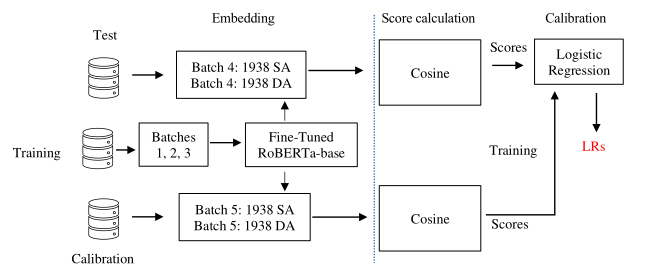
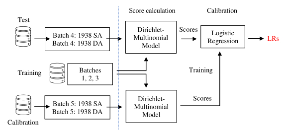

# Likelihood ratio based forensic text comparison systems

Two types of likelihood ratio (LR)-based forensic text comparison systems are available in this repository. One is based on a deep learning (DL) approach and the other is on a machine learning (ML) approach. This repository contains the source codes used in the study presented at the 16th Biennial Conference of the International Association for Forensic & Legal Linguistics. The title of the paper is [Estimating Likelihood Ratios for Authorship Evidence with a Deep-learning-based Text Representation](https://www.dropbox.com/scl/fi/bbg49qyudnze4g5yaqa2z/iafll16_ml_dl_and_ftc.pptx?rlkey=f9yibkev6d1ncazpd35lwnj4o&dl=0). In this study, these two systems are compared at first, and then the results are fused.

The pipeline of the DL system for calculating LRs is given below:

 

The pipeline of the ML system for calculating LRs is given below:

 

# Installation

The DL system was written in Python and the ML system was built using R.

The following libraries are required for the DL system:

  * transformers==4.4
  * torch==1.7
  * pandas
  * sklearn
  * torchinfo

Python 3.7 was used
  * conda create -n IbnA pip python=3.7
  * conda activate IbnA

The following libraries are required for the ML system:

 * library(fitdistrplus)
 * library(stylo)
 * library(actuar)
 * library(StatMatch)
 * library(MASS)
 * library(ROCR)
 * library(stats)
 * library(ROC)
 * library(MGLM)
 * library(usedist)
 * library(dirichlet)
 * library(Compositional)
 * library(MGLM)

# Dataset

This repository works with Amazon Database. [The downloaded database (amazon_database.zip)](https://www.dropbox.com/scl/fi/9uogjxl863wxk24ubgek1/amazon_database.zip?rlkey=6r2oh8tt3d01cfrhbrqtfqmsk&dl=0) which consists of 5 iterations x 5 batches (25 files) should be stored in 'amazon database' directory for the DL system. 

[The feature values extracted from the database ('amazon_database_feature_extracted.zip')](https://www.dropbox.com/scl/fi/wx579mjxihz0x72n800la/amazon_database_feature_extracted.zip?rlkey=lxt9v5grplqgirizmljshpd57&dl=0) should be placed in 'amazon_database_feature_extracted' directory for the ML system.

# Directory structure (DL)

The zipped file 'dl.zip' contains the following directories:
* amazon_database
* evaluation
* execute
* src
* trained_models

You can train the DL system as shown below:

    training.csh

The above shell script, which is stored in 'execute' directory, runs 'model_roberta_self_attention_modified.py' stored in 'src' directory. The trained model should appear in 'trained_models' directory. [A trained model (save_data_ite2_token500.zip)](https://www.dropbox.com/scl/fi/j24wami62xmyg6s1c40au/save_data_Ite2_token500.zip?rlkey=dnv1p4y51ji37f52d9m76kgwn&dl=0) can be downloaded. Due to the limitation of space, only one trained model is available. Please contact the repository owner for a full set of models.

You can carry a series of experiments by excecuting the following shell script which can be found in 'excecute' directory.

    evaluation.csh

All experimental results should appear in 'evaluation' directory.

# Directory structure (ML)

The zipped file 'ml.zip' consists of the following three directories:
 * amazon_database_feature_extracted
 * ml_experiment_outcome
 * src

You can run a series of experiments using the following code which is stored in 'src' directory. The lines 11-15 are for setting experimental conditions.

    batch_experiment.R

All experimental results are stored in 'ml_experiment_outcome' directory.

# Comparisons

The performance differences between the DL and ML systems using the four metrics can be seen in the following table. The table includes the fused resuts between the ML and DL systems.

|       |  cllr  | cllr_min |  cllr_cal |   EER   |
|:-----:|:------:|:--------:|:---------:|:-------:|
| ML    | 0.48560| 0.46017  |  0.02543  | 0.13754 |
| DL    |0.47439 | 0.46281  |  0.01158  | 0.13725 |
| Fused |0.34794 | 0.32483  |  0.02310  | 0.09528 |

